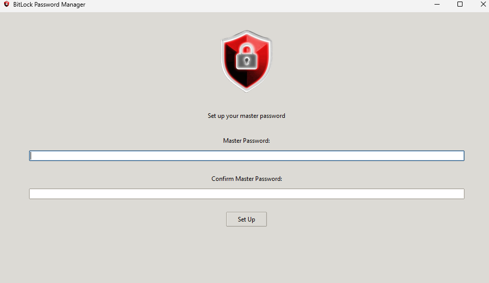
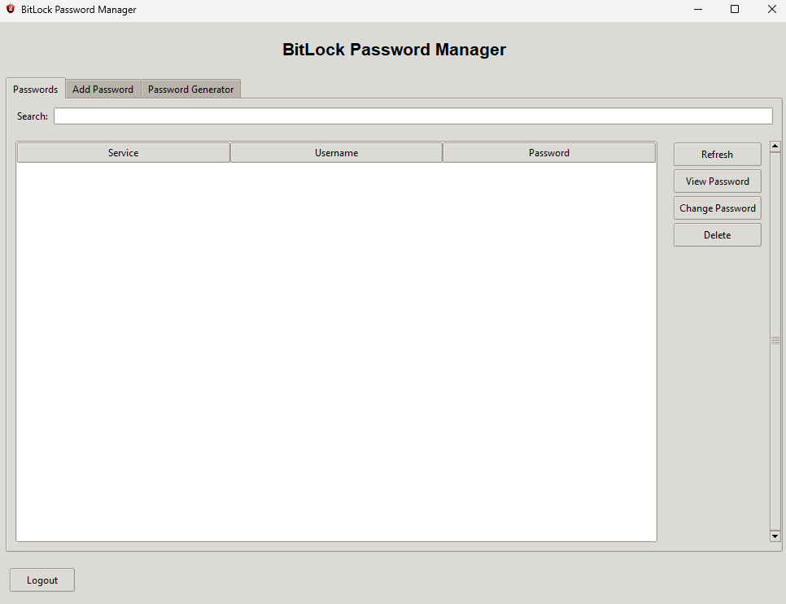
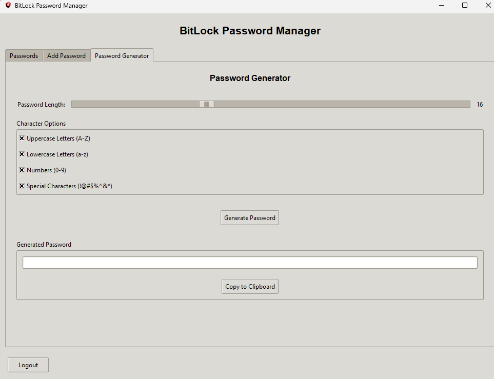

# BitLock Password Manager

A secure password manager with a graphical user interface, 256-bit encryption.

## Features

- **Strong Encryption**: Uses AES-256-GCM with PBKDF2 key derivation (310,000 iterations)
- **User-Friendly Interface**: Intuitive GUI for easy password management
- **Session Security**: Automatic logout after 10 minutes of inactivity
- **Password Management**: Add, view, edit, and delete passwords with ease
- **Secure Storage**: All passwords are encrypted before being stored on disk
- **Reset Capability**: Option to reset all data if needed

## Installation

### Prerequisites

- Python 3.6 or higher
- Required Python packages (install using `pip install -r requirements.txt`):
  - cryptography
  - tkinter (usually included with Python)

### Setup

1. Download the repository

2. Install dependencies:
   ```
   pip install -r requirements.txt
   ```

3. Run main.py


## Security Features

- **512-bit Encryption**: Uses AES-256-GCM for authenticated encryption
- **Key Derivation**: PBKDF2 with SHA-512 and 310,000 iterations
- **Session Timeout**: Automatic logout after 10 minutes of inactivity
- **Secure Storage**: Passwords are never stored in plain text
- **Authentication**: Verifies data integrity during decryption

## File Structure

- `bitlock/`: Main package directory
  - `main.py`: Core application code
- `data/`: Directory for encrypted data (created automatically)
  - `salt.bin`: Salt used for key derivation
  - `passwords.enc`: Encrypted password database

## Contributing

Contributions are welcome! Please feel free to submit a Pull Request.

## License

This project is licensed under the MIT License - see the LICENSE file for details.


## Images



